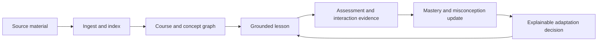
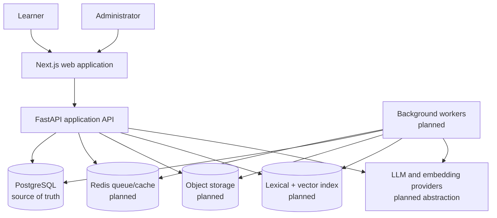

# NeuroLearn

NeuroLearn is a source-grounded adaptive course builder. It transforms learner-provided study material into a structured course, measures learning evidence, and adapts future lessons according to demonstrated mastery rather than a fixed learner label.

This README is an architectural entry point. It intentionally does not contain local installation or run instructions.

## Product Promise

> Upload learning material, receive a source-grounded course, and follow a learning path that adapts according to actual mastery.

The product loop is:



The initial product serves individual learners studying one or two BTech subjects. It supports course creation from PDF, text, Markdown, or pasted content; diagnostic and formative assessment; adaptive lessons; source-grounded tutoring; progress analytics; and measurable pre-test/post-test evaluation.

## Architecture Status

NeuroLearn is undergoing a planned transition from a prototype to the target production architecture.

### Implemented prototype

- Next.js 16, React 19, TypeScript, Tailwind CSS, NextAuth, Recharts, and Framer Motion.
- FastAPI, Pydantic, SQLAlchemy, Alembic, and PostgreSQL.
- Google sign-in integration and backend authentication routes.
- User profiles with four fixed archetypes and simple affinity values.
- Article and paragraph content models.
- Rule-based content transformation that simulates future AI adaptation.
- Prototype mission, reading, profile, dashboard, sign-in, and chat experiences.
- Docker Compose topology for frontend, backend, and PostgreSQL.

### Target production architecture

- Secure, backend-verified identity with resource-level authorization.
- Course-centric, versioned domain model.
- Object storage for source documents.
- Redis-backed job queue and independently scalable workers.
- Reproducible extraction, chunking, embedding, and hybrid retrieval.
- Source-grounded concept graph, curriculum, lessons, assessments, and tutor.
- Evidence-based mastery with uncertainty, misconceptions, review scheduling, and explainable adaptation.
- Consented event collection and computed learner analytics.
- AI quality evaluation, observability, privacy workflows, CI, and production deployment.

Planned components must not be treated as implemented. See [System Architecture](SYSTEM_ARCHITECTURE.md) for the detailed transition map.

## System Context



## Core Architectural Principles

### Source grounded by default

Learning content and tutor answers should derive from authorized uploaded sources. Generated claims retain citations to source chunks and page/section provenance. If evidence is insufficient, the system says so instead of silently using general knowledge.

### Adaptation is evidence, not identity

Declared preferences initialize the learner model but do not permanently classify a learner. Decisions use current mastery, uncertainty, prerequisite readiness, attempts, hints, retries, recency, goals, session constraints, and observed content effectiveness.

### Important decisions are explainable

The system records what it adapted, why, which evidence was used, which rule/model version made the choice, and what outcome followed.

### History is versioned

Source extraction, course structures, learning content, questions, attempts, mastery updates, model calls, and adaptation decisions require enough version information to explain past behavior. Regeneration must not silently invalidate completed work.

### PostgreSQL is authoritative

PostgreSQL stores transactional product state. Redis, caches, queues, object storage, and retrieval indexes support execution or derived access patterns; they do not replace the transactional source of truth.

### Long-running work is asynchronous

Uploads acknowledge quickly. Parsing, embedding, indexing, generation, export, and notifications run through idempotent background jobs with progress, retries, and explicit failures.

### Privacy and authorization cross every layer

Ownership filters apply to SQL, object storage, retrieval, generated content, conversations, events, and administration. Uploaded documents and behavioral evidence are private learner data.

## Target Capability Boundaries

| Capability | Responsibility |
|---|---|
| Identity | Authentication, sessions, user profile, preferences, ownership, data rights |
| Courses | Course lifecycle, goals, versions, modules, lessons, active curriculum |
| Sources | Uploads, validation, extraction, chunking, indexing, provenance, reprocessing |
| Knowledge | Concepts, aliases, source coverage, prerequisite graph |
| Content | Learning blocks, variants, citations, safe regeneration |
| Assessments | Question generation/validation, delivery, attempts, hints, grading |
| Learner model | Mastery, uncertainty, misconceptions, presentation effectiveness, review schedule |
| Adaptation | Candidate generation, ranking, remediation, acceleration, explanations, outcomes |
| Tutor | Course-aware conversations, retrieval, citations, pedagogical modes, learning actions |
| Telemetry | Consented learning events, aggregates, dashboards, adaptation history |
| Operations | Jobs, retries, logs, metrics, tracing, administration, privacy workflows, deployment |

## Primary Data Flow

1. The authenticated learner creates a course with a goal and study constraints.
2. A source document is validated and stored.
3. A worker extracts structured text while retaining page/section provenance.
4. Content is chunked and indexed for lexical and semantic retrieval.
5. The system builds a source-linked concept and prerequisite graph.
6. A versioned course outline and assessment blueprint are generated and reviewed.
7. Lessons are generated as structured, cited learning blocks with presentation variants.
8. Diagnostics and attempts produce evidence for concept mastery and misconceptions.
9. The adaptation engine ranks eligible next activities and records its rationale.
10. Learner interactions and outcomes update the model and close the loop.

## Repository Structure

```text
.
├── backend/               # FastAPI application, domain modules, persistence, migrations
├── frontend/              # Next.js web application
├── docker-compose.yml     # Current local service topology
├── AGENTS.md              # Rules and context for AI coding agents
├── CONTRIBUTING.md        # Human and agent development workflow
├── SYSTEM_ARCHITECTURE.md # Detailed current/target design and data flows
└── README.md              # Product and architecture entry point
```

## Delivery Strategy

The roadmap proceeds through five architectural milestones:

1. **Foundation:** identity, canonical schema, API conventions, tests, and CI.
2. **Course creation:** source ingestion through a reviewable, versioned course.
3. **Adaptive learning loop:** lessons, assessments, mastery, recommendations, and tutor.
4. **Production readiness:** privacy, security, analytics, accessibility, observability, and deployment.
5. **Evaluation:** technical AI evaluation and controlled learning-outcome evaluation.

The first complete vertical slice is more important than broad partial implementation: authenticated course creation, one PDF, ingestion, concept graph, course outline, lesson, assessment, mastery update, adaptation rationale, and progress report.

## Scope Boundary

The initial release excludes instructor portals, collaborative courses, native mobile applications, live classes, payments, marketplaces, unrestricted web research, automated coding sandboxes, biometric signals, reinforcement learning, and permanent learning-style labels.

## Development Documentation

- AI agents must follow [AGENTS.md](AGENTS.md).
- Contributors must follow [CONTRIBUTING.md](CONTRIBUTING.md).
- Architecture and contract decisions belong in [SYSTEM_ARCHITECTURE.md](SYSTEM_ARCHITECTURE.md).
