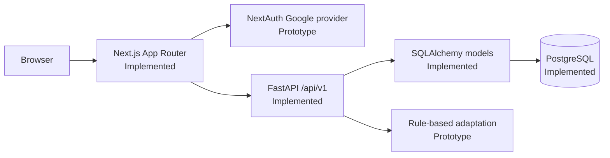
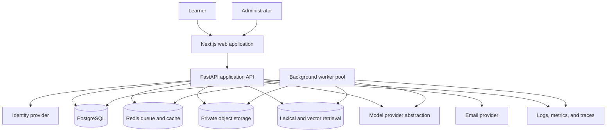
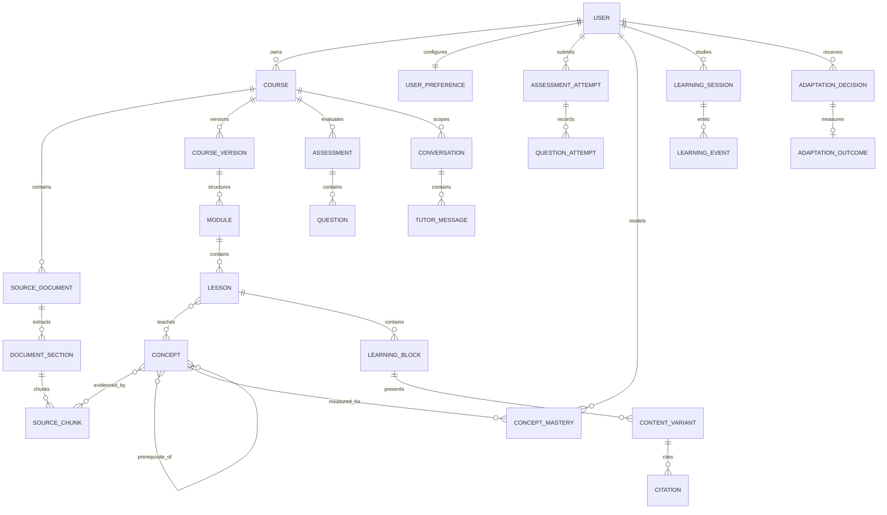
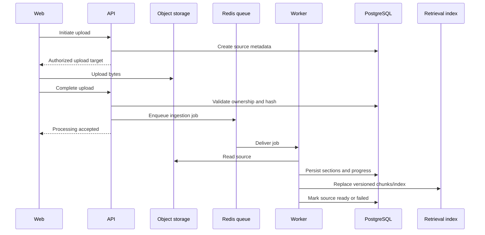
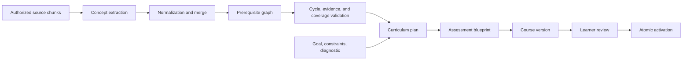
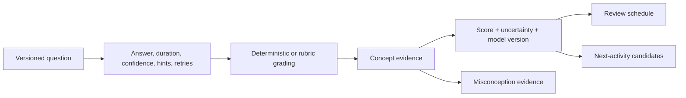

# NeuroLearn System Architecture

## 1. Purpose

This document defines the architectural context for implementing NeuroLearn as a production-grade adaptive course builder. It records:

- what exists in the repository today
- the target architecture
- capability ownership and system boundaries
- critical data flows and state transitions
- cross-cutting security, privacy, reliability, and AI invariants
- the staged migration from prototype to target

It is not an installation guide and does not claim that planned components already exist.

## 2. Product Boundary

NeuroLearn accepts learner-owned source material, constructs a cited course, observes learning evidence, updates a learner model, and selects the next experience. The system’s academic contribution is not content generation alone; it is a measurable, explainable feedback loop.

Initial actors:

- **Learner:** owns courses and sources, studies lessons, completes assessments, uses the tutor, and controls personal data.
- **Administrator:** monitors aggregate health, usage, failures, and reported content; recovers safe jobs without unrestricted access to private learner material.
- **External providers:** identity, email, object storage, model/embedding providers, and operational monitoring.

Instructor, classroom, collaboration, commerce, and native-mobile domains are outside the initial boundary.

## 3. Architecture Status Legend

| Status | Meaning |
|---|---|
| Implemented | Present in this repository and part of current behavior |
| Prototype | Present but intentionally incomplete, simulated, insecure, or not production-ready |
| Planned | Required target component not yet implemented |
| Deferred | Explicitly outside the initial product boundary |

## 4. Current Repository Architecture



### 4.1 Current frontend

The frontend uses Next.js 16, React 19, TypeScript, App Router, NextAuth, Tailwind CSS, Recharts, and Framer Motion. Routes exist for sign-in, dashboard, profile, mission/calibration, reading, and chat. Components track some visibility and interaction data.

Current risks and limitations:

- authentication/backend synchronization follows multiple inconsistent paths
- a backend token is exposed through client session state
- an internal synchronization secret has a client-visible/default path
- several screens and analytics are prototype or hard-coded
- chat and upload are not complete product workflows
- API access is not yet a unified typed contract

### 4.2 Current backend

The backend uses FastAPI, Pydantic, SQLAlchemy, Alembic, and PostgreSQL. Current modules include authentication, profile, profiling, and content. The persistent model centers on users, one profile, articles, and paragraphs.

Current risks and limitations:

- application startup invokes `Base.metadata.create_all`, which bypasses migration-only evolution
- the domain model does not yet represent courses, source documents, concepts, versions, assessments, attempts, mastery, sessions, events, or tutor conversations
- resource-level authorization is incomplete
- adaptation is a synchronous rule-based string transformation
- there is no functioning queue/worker pipeline
- Qdrant, MinIO, and related packages appear as dependencies but are not integrated into the product flow
- there is no complete automated test or observability system

### 4.3 Current deployment topology

Docker Compose currently defines three services:

- frontend
- backend
- PostgreSQL

Redis, workers, object storage, retrieval services, and production monitoring remain planned.

## 5. Target System Context



The initial deployment may remain a modular monolith plus separate workers. Capability boundaries should be explicit in code without prematurely creating networked microservices.

## 6. Runtime Components

### 6.1 Web application

Responsibilities:

- authenticated learner and administrator experiences
- course creation and processing status
- course review and lesson delivery
- diagnostics, assessments, notes, bookmarks, and tutor interaction
- mastery, concept graph, review queue, and adaptation history
- privacy, notification, accessibility, and account controls

The web application does not decide authorization, mastery, grading, retrieval access, or job state. Those decisions are server-owned.

### 6.2 Application API

The FastAPI application is the synchronous boundary for:

- authentication and resource authorization
- input validation and API contracts
- course, lesson, assessment, learner-model, tutor, and privacy orchestration
- transactional writes to PostgreSQL
- job creation and status queries
- authorized retrieval and low-latency model interactions
- administration and health endpoints

The API should remain horizontally scalable and avoid local in-memory state required for correctness.

### 6.3 Background workers

Workers execute long-running or retryable workflows:

- document verification, extraction, OCR, cleaning, chunking, embedding, and indexing
- concept extraction and graph validation
- course, lesson, assessment, and partial regeneration
- data export and derived-store deletion
- notification delivery
- offline evaluation and aggregate computation where appropriate

Jobs use explicit states, progress, heartbeats, idempotency keys, bounded retries, cancellation rules, and terminal failure reasons.

### 6.4 PostgreSQL

PostgreSQL is the transactional source of truth for:

- identities and preferences
- courses and active versions
- source metadata and processing jobs
- curriculum, lessons, content variants, and citations
- concepts and prerequisite relationships
- assessments, questions, attempts, and answers
- mastery, misconceptions, adaptation decisions, and outcomes
- sessions, events, conversations, messages, notes, and bookmarks
- consent, notifications, audit records, and administrative configuration

### 6.5 Redis

Planned Redis responsibilities:

- job queue and delayed retries
- worker coordination and short-lived locks
- cancellation/progress fan-out
- bounded caching and rate-limit counters

Redis is not the authoritative store for course, attempt, mastery, or job history.

### 6.6 Object storage

Private object storage contains original uploads and, where justified, generated binary artifacts. PostgreSQL stores ownership, version, hash, MIME, size, processing state, and object keys. Browser access uses short-lived authorized URLs.

### 6.7 Retrieval index

The target uses hybrid retrieval:

- lexical search for exact terms, code, symbols, and uncommon phrases
- vector search for semantic similarity
- optional reranking for final ordering

Every indexed chunk includes owner/course/document identifiers, page/section provenance, offsets, content hash, extraction version, and embedding version. Authorization filters are applied as part of the query, not after retrieving unauthorized candidates.

### 6.8 Model provider abstraction

Chat/generation and embedding providers sit behind application interfaces. Each request records the relevant provider/model, prompt/template, schema, source, configuration, timing, token/cost, and validation versions.

Automated tests use deterministic fakes. Provider failure must not corrupt the last known-good course or learner state.

## 7. Capability Boundaries

### 7.1 Identity and preferences

Owns users, external identities, sessions, preferences, consent, exports, deletion, and resource-ownership primitives. Backend identity is derived from verified credentials, never client-supplied emails or user IDs.

### 7.2 Courses and curriculum

Owns course lifecycle, goals, constraints, state transitions, versions, modules, lessons, activation, archival, and dashboard aggregation contracts.

Course states:

```text
DRAFT -> PROCESSING -> READY_FOR_REVIEW -> ACTIVE -> COMPLETED
                   \-> FAILED
ACTIVE/COMPLETED -> ARCHIVED
```

Transitions are validated server-side. A failed generation never replaces the active version.

### 7.3 Sources and ingestion

Owns documents, upload validation, object metadata, extraction, sections, chunks, processing versions, indexing, reprocessing, and source deletion.

### 7.4 Knowledge graph

Owns concepts, aliases, source coverage, difficulty, prerequisite/related edges, confidence, validation, and graph versioning.

### 7.5 Learning content

Owns structured learning blocks, content variants, citations, generation provenance, validation status, and partial regeneration boundaries.

### 7.6 Assessments

Owns assessment purposes, question blueprints and versions, attempts, submitted answers, hints, feedback, grading, validation, and review queues.

### 7.7 Learner model and adaptation

Owns concept mastery, uncertainty, misconception evidence, presentation affinity, review scheduling, recommendation candidates, ranking, adaptation decisions, overrides, and measured outcomes.

### 7.8 Tutor

Owns course-scoped conversations, messages, pedagogical modes, grounded retrieval, citations, streaming/cancellation, and conversion of messages into learning resources.

### 7.9 Telemetry and analytics

Owns consented learning events, idempotent batch intake, metric definitions, aggregates, learner dashboards, concept visualization, and adaptation history.

### 7.10 Operations and administration

Owns health, job recovery, aggregate usage, storage, AI cost, failure visibility, moderation reports, audit records, observability, and safe configuration.

## 8. Core Domain Relationships



Exact fields and constraints belong in migrations and model documentation, but these ownership relationships are architectural invariants.

## 9. Primary Workflows

### 9.1 Source ingestion and indexing



Ingestion stages:

1. Upload verification
2. Security inspection
3. Extraction/OCR decision
4. Cleaning and structural normalization
5. Chunking
6. Embedding and lexical/vector indexing
7. Quality checks

The workflow is idempotent by source and processing version. Reprocessing creates a new extraction/index version and does not mutate historical course provenance.

### 9.2 Concept graph and course generation



Every concept and generated structure retains source or inference provenance. The learner may reorder/remove draft modules. Activation is atomic and leaves the previous version recoverable.

### 9.3 Grounded lesson and tutor response

1. Build a query from course, lesson/concept, learner intent, and pedagogical mode.
2. Apply owner/course/document authorization filters.
3. Run hybrid retrieval and construct bounded context.
4. Generate structured output containing citation chunk IDs.
5. Validate schema, source existence, citation support, safety, and evidence boundaries.
6. Persist the versioned result before presenting it as durable learning content.
7. If source evidence is insufficient, state that explicitly; supplemental mode requires an explicit product decision and visible labeling.

Uploaded text is delimited and treated as data. Instructions embedded in a source cannot change authorization, system policy, tool access, or evidence mode.

### 9.4 Assessment and mastery update



Low-confidence semantic grading is visible and must not be converted into certain mastery evidence. Historical attempts always reference the question and grading versions used at the time.

### 9.5 Adaptive sequencing

Candidate generation considers only activities compatible with the active course and prerequisite readiness. Ranking may use:

- mastery gap and uncertainty
- prerequisite importance
- review due state and recency
- recent errors and misconceptions
- course goal and deadline
- available session duration
- difficulty and expected learning value
- observed effectiveness of presentation variants

The selected action produces an `AdaptationDecision` with versioned inputs and a learner-readable reason. Acceptance, override, performance, and later retention can form an `AdaptationOutcome`.

## 10. API Architecture

All new product endpoints use `/api/v1`.

### 10.1 Boundary conventions

- authenticated principal derived server-side
- Pydantic request/response contracts
- stable success and error envelopes
- request/correlation ID on every response
- cursor pagination for collections
- idempotency keys for retryable create/submit operations
- optimistic concurrency for editable/versioned resources
- consistent authorization-aware 401/403/404 behavior
- OpenAPI examples and contract tests

### 10.2 Capability routes

Target route groups:

```text
/api/v1/users
/api/v1/courses
/api/v1/courses/{course_id}/documents
/api/v1/courses/{course_id}/versions
/api/v1/courses/{course_id}/concepts
/api/v1/lessons
/api/v1/assessments
/api/v1/mastery
/api/v1/recommendations
/api/v1/conversations
/api/v1/events
/api/v1/notifications
/api/v1/admin
```

Route handlers validate and orchestrate. Domain/application services decide behavior. Repositories isolate persistence. Provider clients isolate external systems.

## 11. State, Versioning, and Consistency

### 11.1 Versioned artifacts

At minimum, preserve version references for:

- source extraction and chunks
- embedding/index configuration
- concept graph
- course structure
- learning blocks and variants
- questions, rubrics, and answer keys
- prompts, models, schemas, and validators
- mastery/adaptation algorithms

### 11.2 Transaction boundaries

Use database transactions for authoritative state changes such as:

- activating a course version
- starting/submitting an assessment attempt
- recording graded evidence and its mastery update
- creating a job and its durable intent
- changing consent or deletion state

External calls and queue delivery are not part of the database transaction. Use idempotency, outbox-style intent where needed, reconciliation, and guarded state transitions rather than assuming exactly-once delivery.

### 11.3 Failure behavior

- A failed generated version never replaces the active version.
- A duplicate job does not duplicate derived records.
- A provider outage preserves accepted input and exposes retryable status.
- A partial deletion remains tracked until all stores are reconciled.
- A stale edit returns a conflict rather than overwriting a newer version.
- A low-confidence grade or unsupported answer remains uncertain instead of becoming false fact.

## 12. Security and Privacy Architecture

### 12.1 Trust boundaries

Untrusted inputs include:

- browser payloads and identifiers
- uploaded files and embedded instructions
- model outputs
- provider callbacks
- event timestamps and repeated submissions
- filenames, MIME metadata, and URLs

Every boundary validates type, size, ownership, state, and allowed transitions.

### 12.2 Authentication and authorization

- Verify identity-provider tokens on a trusted backend path.
- Issue/revoke secure application sessions.
- Do not place reusable internal secrets or backend bearer tokens in browser-readable state.
- Centralize authorization and enforce owner/course filters in storage and retrieval queries.
- Audit administrative and security-sensitive actions.

### 12.3 Data protection

- Encrypt transport and production storage.
- Keep raw documents private.
- Use short-lived authorized object URLs.
- Exclude secrets and unnecessary private content from logs/traces.
- Apply retention, export, and deletion across PostgreSQL, object storage, retrieval indexes, queues, caches, and derived content.
- Collect optional behavioral events only with the applicable consent.

### 12.4 AI-specific controls

- separate system instructions from source content
- source-only default mode
- authorization-filtered retrieval
- structured outputs and allow-listed actions
- citation and evidence validation
- token, rate, and cost limits
- abuse reporting and safe failure
- dedicated prompt-injection and cross-course isolation tests

## 13. Observability and Quality

### 13.1 Correlation

Requests, jobs, retrieval calls, model calls, and persistent versions share correlation identifiers. User-safe identifiers may be logged; private source text, answers, tokens, and conversations are not logged by default.

### 13.2 Signals

Logs:

- structured event name, severity, request/job/course identifiers, state transition, error class

Metrics:

- API latency/error rate
- upload acknowledgment
- queue depth and oldest age
- worker heartbeat and job duration/failures
- extraction/index/generation quality and latency
- retrieval recall evaluation
- citation/groundedness validity
- model tokens/cost/timeouts
- assessment/grading uncertainty
- deletion/export completion

Traces:

- browser/API boundary where available
- API to database/queue
- worker stages
- retrieval and model calls

Alerts focus on sustained symptoms: 5xx rate, queue backlog, no workers, repeated job failure, storage/database health, AI budget anomalies, and privacy workflow failures.

## 14. Testing Strategy

Testing layers:

| Layer | Purpose |
|---|---|
| Unit | Deterministic parsing helpers, state transitions, grading, mastery, ranking |
| Persistence | Constraints, migrations, ownership, version queries, transactions |
| API | Auth, authorization, validation, idempotency, errors, concurrency |
| Contract | Cross-workstream schemas, events, jobs, provenance, provider interfaces |
| Component | UI state and accessibility behavior |
| End-to-end | Critical source-to-adaptation learner journey |
| AI evaluation | Extraction, retrieval, citations, groundedness, question validity, pedagogy |
| Academic evaluation | Learning gain, time-to-mastery, retention, usability, limitations |

Automated tests must not require production learner data or paid model calls. Deterministic fakes and curated, license-compatible fixtures are required.

## 15. Deployment Shape

The target remains deployable as a modular monolith:

- stateless web deployment
- stateless API deployment
- independently scalable worker deployment
- managed PostgreSQL
- managed Redis
- private object storage
- vector/lexical retrieval service or PostgreSQL-compatible implementation
- external identity/email/model providers
- centralized telemetry

API and workers may share a codebase and domain packages while running as separate processes. Split into networked services only when scale, isolation, ownership, or operational evidence justifies the cost.

## 16. Evolution Plan

### Stage 0 — Documentation and contracts

- repository agent guide
- contribution workflow
- current/target architecture map
- issue decomposition and contract ownership

### Stage 1 — Foundation

- replace insecure/inconsistent authentication paths
- canonical domain model and Alembic migrations
- API conventions and generated/typed contracts
- automated tests, deterministic providers, and CI
- shared job abstraction

### Stage 2 — Source-to-course slice

- one validated PDF upload
- extraction and provenance
- hybrid index
- concept graph
- reviewable course version
- atomic activation

### Stage 3 — Adaptive loop

- grounded lessons and variants
- diagnostics and assessments
- mastery and misconception updates
- next-activity recommendation and explanation
- learner session and tutor

### Stage 4 — Production readiness

- real analytics and adaptation history
- privacy and deletion
- notifications and accessibility
- security hardening
- observability, administration, backup, load, and deployment validation

### Stage 5 — Evaluation

- technical AI quality and cost regression suite
- static-versus-adaptive learning study
- reproducible final demonstration and limitations report

## 17. Architecture Decision Process

Material decisions should be recorded in the relevant Linear issue and summarized here or in a future `docs/adr/` record. A material decision changes one or more of:

- trust or authorization boundary
- source of truth
- persistent entity/state machine
- public API, event, or job contract
- model/retrieval evidence policy
- versioning or regeneration semantics
- deployment topology
- privacy, retention, or deletion behavior

An architecture decision should state context, options, decision, consequences, migration path, and rollback/exit strategy.

## 18. Non-Negotiable Invariants

1. A user cannot access another user’s sources, courses, retrieval results, attempts, mastery, or conversations.
2. Generated source-dependent content is cited or explicitly marked unsupported/supplemental.
3. Uploaded text cannot become trusted system instruction.
4. Regeneration cannot silently destroy active progress or historical provenance.
5. Low evidence cannot produce false mastery certainty.
6. Important adaptations are versioned and explainable.
7. Long-running workflows are idempotent and recoverable.
8. PostgreSQL remains the transactional source of truth.
9. Optional behavioral telemetry respects consent.
10. Architecture documentation distinguishes implemented, prototype, planned, and deferred behavior.
