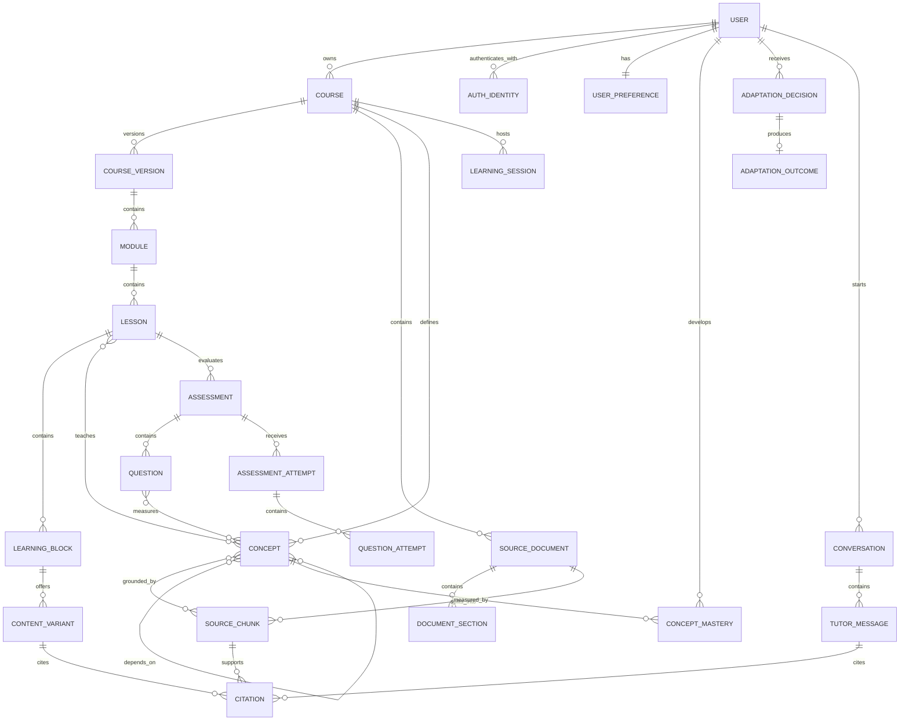
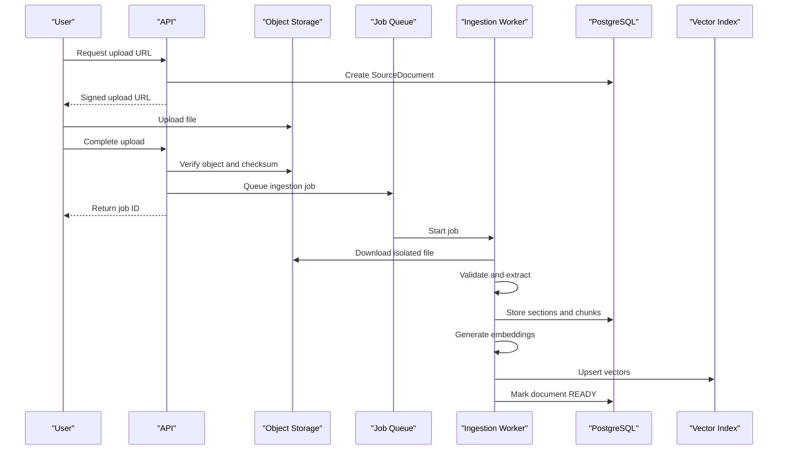
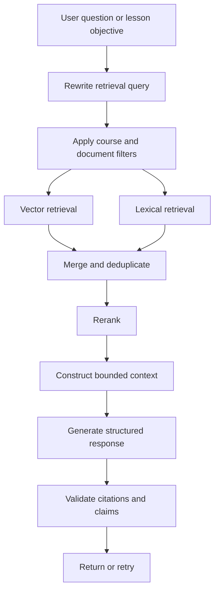

# NeuroLearn — System Design, Part 1

## Product definition

NeuroLearn is an adaptive AI course builder that transforms user-provided learning material into a structured course and continuously personalizes the course based on demonstrated knowledge, behavior, goals, and presentation preferences.

The system’s core promise is:

> Upload learning material, receive a source-grounded course, and follow a learning path that adapts according to actual mastery.

For the initial production scope:

- Primary user: individual BTech student
- Supported input: PDF, plain text, Markdown and pasted content
- Primary output: structured course with modules, lessons and assessments
- Supported learning formats:

  - regular explanation
  - concise summary
  - detailed explanation
  - analogy
  - worked example
  - diagram
  - flashcard
  - quiz

- Adaptation basis:

  - diagnostic performance
  - concept mastery
  - answer history
  - hint usage
  - lesson interactions
  - declared goals and preferences

- Initial deployment: web application
- Initial subject focus for evaluation: one or two BTech subjects
- Initial roles: learner and administrator
- Instructor functionality is deferred to a later version

---

# 1. Functional Requirements

Functional requirements describe what the system must do.

## 1.1 User identity and account management

### FR-AUTH-01: User registration and sign-in

The system shall allow users to authenticate through:

- Google OAuth
- Email and password, if added later

The backend must establish the user’s identity independently of client-supplied email headers.

### FR-AUTH-02: User profile

The system shall maintain:

- name
- email
- profile picture
- timezone
- education level
- areas of study
- preferred language
- accessibility preferences
- onboarding completion state

### FR-AUTH-03: Session management

The system shall:

- issue secure authenticated sessions
- expire sessions
- support sign-out
- revoke compromised sessions
- prevent one user from accessing another user’s resources

### FR-AUTH-04: Data controls

Users shall be able to:

- export their learning data
- delete uploaded documents
- delete a course
- delete their account
- opt out of optional behavioral telemetry

---

## 1.2 Onboarding and learning goals

### FR-ONB-01: Goal selection

A learner shall define a goal when creating a course:

- understand a subject
- prepare for an examination
- revise known material
- complete a syllabus
- learn for a project
- prepare for an interview

### FR-ONB-02: Learning constraints

The learner shall be able to provide:

- target completion date
- available study time per day or week
- preferred session duration
- expected difficulty
- current familiarity
- desired depth

### FR-ONB-03: Initial preferences

The user may state initial preferences such as:

- concise or detailed explanations
- more examples
- more diagrams
- theory-first or problem-first
- preferred language
- accessibility requirements

These should initialize the learner model, not permanently classify the learner.

### FR-ONB-04: Diagnostic assessment

Before course generation or at the beginning of a course, the system shall optionally conduct a diagnostic assessment.

The diagnostic should estimate:

- prior knowledge
- prerequisite gaps
- confidence
- misconceptions
- appropriate starting difficulty

### FR-ONB-05: Skip support

A user may skip the diagnostic, but the system must:

- initialize mastery as unknown rather than zero
- begin with conservative difficulty
- update estimates from later interactions

---

## 1.3 Course workspace management

### FR-CRS-01: Create course

A user shall create a course by supplying:

- course title
- learning goal
- source material
- target date
- optional syllabus
- optional preferences

### FR-CRS-02: Course states

A course shall have one of the following states:

- `DRAFT`
- `PROCESSING`
- `READY_FOR_REVIEW`
- `ACTIVE`
- `COMPLETED`
- `FAILED`
- `ARCHIVED`

### FR-CRS-03: Course dashboard

Each course shall display:

- overall progress
- estimated mastery
- modules completed
- current learning streak
- remaining study time
- next recommended lesson
- weak concepts
- upcoming review items
- document-processing status

### FR-CRS-04: Modify course

The learner shall be able to:

- rename a course
- change the goal
- change the target date
- adjust study time
- add or remove source material
- regenerate the course outline
- archive or delete the course

If a course already contains progress, regeneration must preserve the previous course version or require explicit confirmation.

### FR-CRS-05: Multiple courses

A user may own multiple independent courses. Mastery data should normally remain course-specific, with an optional global concept model added later.

---

## 1.4 Source document ingestion

### FR-DOC-01: Upload material

The system shall accept:

- PDF
- TXT
- Markdown
- pasted text

DOCX and PPTX may be added after the first production release.

### FR-DOC-02: Validate upload

Before processing, the system shall validate:

- file extension
- MIME type
- file size
- page count
- empty or corrupted content
- duplicate content
- ownership
- malware status where practical

### FR-DOC-03: Store original document

The original file shall be stored in object storage, while metadata is stored in PostgreSQL.

### FR-DOC-04: Asynchronous processing

Document processing shall occur asynchronously. Users must not wait on a single HTTP request while parsing, embedding and course generation take place.

### FR-DOC-05: Processing status

The interface shall report stages such as:

- uploading
- extracting text
- processing pages
- identifying concepts
- creating search index
- generating course outline
- generating diagnostic
- ready
- failed

### FR-DOC-06: Text extraction

The system shall extract:

- page text
- headings
- sections
- lists
- tables where possible
- code blocks where possible
- page references

The system must preserve provenance between extracted text and the source document.

### FR-DOC-07: OCR

Scanned PDFs should either:

- be processed using OCR, or
- be rejected with a clear explanation in the first version

### FR-DOC-08: Source indexing

Extracted content shall be split into chunks and indexed for semantic and lexical retrieval.

Each chunk shall retain:

- document ID
- page number
- section heading
- character or token offsets
- extraction version
- searchable text

### FR-DOC-09: Reprocessing

The system shall permit reprocessing after:

- parser improvements
- configuration changes
- failed processing
- document replacement

Reprocessing must not silently destroy earlier course versions.

---

## 1.5 Course generation

### FR-GEN-01: Generate course outline

The system shall generate a structured outline containing:

- course objective
- modules
- lessons
- concepts
- prerequisite relationships
- estimated time
- difficulty
- assessment points

### FR-GEN-02: Source-grounded generation

Every generated lesson must be grounded in:

- the uploaded source material, or
- clearly marked supplemental knowledge if the product allows external knowledge

The default mode should use uploaded sources only.

### FR-GEN-03: Concept graph

The system shall identify:

- concepts
- prerequisite concepts
- related concepts
- module membership
- source coverage
- estimated difficulty

### FR-GEN-04: Course review

Before activation, the learner shall be able to review:

- generated modules
- lesson order
- expected duration
- detected source coverage
- diagnostic plan

The user may remove or reorder modules before starting.

### FR-GEN-05: Course versioning

Every material course regeneration shall produce a new course version.

The system must record:

- generation model
- prompt/template version
- source versions
- generation timestamp
- configuration
- validation result

### FR-GEN-06: Partial regeneration

The learner shall be able to regenerate:

- one explanation
- one lesson
- one quiz
- one module
- the complete course

Partial regeneration should not overwrite unrelated content.

### FR-GEN-07: Generation validation

Generated content shall be checked for:

- valid structure
- source support
- duplicate lessons
- missing concepts
- invalid citations
- answer-key consistency
- unsafe or malformed output

---

## 1.6 Lesson delivery

### FR-LSN-01: Lesson structure

A lesson may contain ordered learning blocks:

- learning objectives
- prerequisite recap
- explanation
- summary
- worked example
- diagram
- code block
- misconception warning
- knowledge check
- reflection prompt
- source citations

### FR-LSN-02: Content variants

The system shall maintain multiple presentation variants for a concept or block.

For example:

- concise
- detailed
- example-driven
- analogy-driven
- visual
- problem-first
- revision-oriented

### FR-LSN-03: Original source access

The learner shall be able to inspect the source passage supporting generated content.

### FR-LSN-04: Manual controls

Users shall be able to request:

- explain more simply
- explain in more depth
- show an example
- show a diagram
- give an analogy
- test me
- show the original source
- switch to the original version

Manual selections shall be treated as preference signals.

### FR-LSN-05: Session management

The system shall record:

- lesson start
- lesson completion
- active duration
- block exposure
- selected variants
- interruption and resumption
- assessment attempts

### FR-LSN-06: Resume learning

The user shall resume at the last meaningful position in the course.

### FR-LSN-07: Notes and bookmarks

The learner should be able to:

- bookmark a lesson
- save a source passage
- create a note
- revisit difficult concepts

---

## 1.7 Adaptive learning behavior

### FR-ADP-01: Maintain learner model

For each learner and course, the system shall maintain:

- concept mastery
- uncertainty in the mastery estimate
- misconception history
- presentation effectiveness
- pace
- engagement indicators
- declared preferences
- recent learning context

### FR-ADP-02: Select next learning activity

The adaptation engine shall recommend the next activity using:

- prerequisite readiness
- mastery gap
- course goal
- deadline
- review schedule
- recent errors
- estimated difficulty
- available session duration

### FR-ADP-03: Select content presentation

The system shall select a presentation variant according to:

- current mastery
- recent performance
- previously successful variants
- user preference
- lesson objective
- session context

### FR-ADP-04: Remediation

When a learner struggles, the system may:

- reduce difficulty
- review a prerequisite
- provide a worked example
- provide a misconception-specific explanation
- provide a hint
- produce a simpler question
- schedule the concept for later review

### FR-ADP-05: Acceleration

When mastery is high, the system may:

- shorten explanations
- skip redundant examples
- increase question difficulty
- offer a challenge problem
- move to dependent concepts

### FR-ADP-06: Adaptation explanation

Every important adaptation shall be explainable to the learner.

Examples:

- “Reviewing process synchronization because two prerequisite questions were answered incorrectly.”
- “Switching to an example because example-based explanations have produced better results in this course.”

### FR-ADP-07: User override

The learner shall be able to ignore a recommendation or select a different activity.

### FR-ADP-08: Avoid permanent labels

The system shall not lock a learner into a single archetype. Friendly archetypes may appear in the UI, but actual decisions must be driven by continuously updated data.

---

## 1.8 Assessments and mastery

### FR-ASM-01: Assessment types

The system shall support:

- multiple-choice questions
- multiple-select questions
- true/false questions
- short-answer questions
- ordering questions
- concept matching
- numerical problems where appropriate

Coding assessments may be added in a specialized technical-subject release.

### FR-ASM-02: Assessment purposes

Assessments shall be categorized as:

- diagnostic
- formative
- lesson check
- module assessment
- review
- final assessment

### FR-ASM-03: Question metadata

Each question must include:

- concept IDs
- difficulty
- learning objective
- expected answer
- explanation
- supporting citations
- generation provenance
- validation status

### FR-ASM-04: Attempt recording

Every attempt shall record:

- selected or submitted answer
- correctness
- response duration
- confidence, if requested
- hints used
- retries
- feedback shown
- question version
- timestamp

### FR-ASM-05: Feedback

The system shall provide feedback that:

- explains the correct reasoning
- identifies likely misconceptions
- references relevant lesson material
- avoids revealing the answer too early when hints are requested

### FR-ASM-06: Mastery update

A completed attempt shall update mastery for the associated concepts.

The update must account for:

- question difficulty
- correctness
- hints
- repeated attempts
- response confidence
- recency
- prior mastery uncertainty

### FR-ASM-07: Review scheduling

The system shall schedule concepts for review using:

- mastery
- elapsed time
- previous failures
- memory strength
- course deadline

### FR-ASM-08: Final learning report

After course completion, the learner shall receive:

- pre-test and post-test comparison
- concept mastery map
- strong and weak concepts
- time invested
- review recommendations
- course completion record

---

## 1.9 Source-grounded AI tutor

### FR-TUT-01: Course-aware chat

The learner shall ask questions within a course.

The tutor must be aware of:

- current course
- current lesson
- recent conversation
- learner mastery
- uploaded sources

### FR-TUT-02: Retrieval before response

For source-dependent questions, the tutor shall retrieve relevant source chunks before generating an answer.

### FR-TUT-03: Citations

The tutor shall cite:

- source document
- page number
- section where available

### FR-TUT-04: Evidence boundaries

If the sources do not support an answer, the tutor shall:

- state that the provided material is insufficient
- ask permission before using general knowledge, if supplemental mode exists

### FR-TUT-05: Pedagogical modes

The learner may request:

- direct answer
- Socratic guidance
- hint
- analogy
- worked example
- revision
- quiz mode

### FR-TUT-06: Conversation persistence

Chat sessions and messages shall be saved within their course.

### FR-TUT-07: Chat-to-learning actions

A user may convert a response into:

- note
- flashcard
- revision item
- new quiz question
- bookmarked explanation

---

## 1.10 Analytics and progress

### FR-ANA-01: Learner dashboard

The dashboard shall display real, computed data for:

- course completion
- module progress
- mastery by concept
- recent sessions
- learning time
- assessment performance
- upcoming reviews
- weak prerequisites

### FR-ANA-02: Concept graph visualization

The learner should be able to view a graph showing:

- mastered concepts
- developing concepts
- weak concepts
- locked concepts
- prerequisite relationships

### FR-ANA-03: Adaptation history

The learner shall be able to inspect major adaptation decisions and their rationale.

### FR-ANA-04: Event collection

The system shall collect meaningful events such as:

- lesson started
- content variant shown
- variant manually changed
- lesson completed
- question answered
- hint requested
- source opened
- tutor question asked
- recommendation accepted or rejected

The system should avoid collecting high-frequency noise without a clear purpose.

### FR-ANA-05: Product analytics

Administrators shall be able to monitor aggregate metrics without accessing unnecessary private content.

---

## 1.11 Notifications

### FR-NOT-01: Study reminders

Users may opt into:

- scheduled study reminders
- review-due notifications
- course deadline warnings
- document-processing completion notifications

### FR-NOT-02: Notification preferences

Users shall control:

- channel
- frequency
- quiet hours
- reminder type

Email is sufficient for the initial version.

---

## 1.12 Administrative functionality

### FR-ADM-01: System dashboard

Administrators shall view:

- active users
- courses created
- processing failures
- generation failures
- AI usage
- storage usage
- system health

### FR-ADM-02: Content moderation

Administrators may inspect reported generated content while respecting privacy constraints.

### FR-ADM-03: Job recovery

Administrators shall be able to:

- inspect failed jobs
- retry safe jobs
- cancel jobs
- view error reasons

### FR-ADM-04: Configuration

Administrators may manage:

- supported models
- generation limits
- upload limits
- feature flags
- prompt versions
- maintenance mode

---

# 2. Non-Functional Requirements

## 2.1 Performance

### NFR-PERF-01: API latency

For ordinary non-AI operations:

- p50 latency: below 200 ms
- p95 latency: below 500 ms
- p99 latency: below 1 second

Examples include profile retrieval, course lists and progress retrieval.

### NFR-PERF-02: AI interaction latency

For tutor responses:

- first streamed token should normally arrive within 3 seconds
- complete response should normally arrive within 15 seconds
- requests exceeding the configured timeout must terminate gracefully

### NFR-PERF-03: Upload acknowledgment

An upload request should return a document ID within 2 seconds after object-storage acceptance. Processing continues asynchronously.

### NFR-PERF-04: Course generation

For a normal document of up to approximately 100 pages:

- extraction and indexing target: under 5 minutes
- initial course-outline target: under 3 minutes after indexing
- individual lesson generation target: under 30 seconds

These are targets, not synchronous request timeouts.

### NFR-PERF-05: Dashboard

A course dashboard should become interactive within approximately 2.5 seconds on a normal broadband connection.

---

## 2.2 Scalability

### Initial capacity target

The first production version should support approximately:

- 10,000 registered users
- 1,000 daily active users
- 200 concurrent users
- 20 concurrent AI generations
- documents up to 100 MB
- courses with up to 1,000 concepts or learning objects

### Scaling strategy

The design should allow independent scaling of:

- web frontend
- API instances
- document workers
- AI-generation workers
- vector search
- event processing

Application servers should remain stateless wherever possible.

---

## 2.3 Availability and reliability

### NFR-REL-01: Availability

Target monthly availability:

- application and core APIs: 99.5%
- AI generation features: best effort with graceful fallback

A student should still be able to access previously generated course content when an LLM provider is unavailable.

### NFR-REL-02: Idempotency

The following operations must support idempotency:

- document creation
- processing-job creation
- course generation
- assessment submission
- payment operations if introduced later

### NFR-REL-03: Retry behavior

Background jobs shall use:

- bounded retries
- exponential backoff
- dead-letter state after repeated failure
- idempotent stage execution

### NFR-REL-04: Data integrity

The system must prevent:

- partially created course versions becoming active
- duplicate assessment attempts from network retries
- mastery updates without a valid attempt
- deletion of a source still required by an active version without explicit handling

### NFR-REL-05: Graceful degradation

If AI generation is unavailable:

- existing lessons remain accessible
- assessments already generated remain usable
- progress tracking continues
- generation requests enter a retryable state

---

## 2.4 Security

### Authentication

- Use OAuth/OIDC and signed, short-lived access tokens.
- Verify issuer, audience, expiry and signature.
- Do not trust client-provided email identity.
- Do not expose backend internal secrets through `NEXT_PUBLIC_*` variables.

### Authorization

Every resource access must validate ownership or role:

```text
Authenticated user
    -> requested course
    -> course.owner_id equals user.id
    -> child resource belongs to that course
```

A direct document or lesson ID must never bypass course ownership validation.

### Data protection

- TLS for all network traffic
- encryption at rest through database and object-storage controls
- password hashing with Argon2 if password login is introduced
- secrets stored in a secret manager
- sensitive values excluded from logs

### Upload security

- MIME verification
- extension validation
- file-size limits
- filename sanitization
- malware scanning
- isolated parsing
- signed object-storage URLs
- no direct execution of uploaded content

### AI security

The system must defend against document-based prompt injection.

Uploaded text must be treated as untrusted data, not as system instructions. Retrieval prompts should explicitly separate:

- system policy
- developer instruction
- retrieved untrusted content
- user question

The system must also restrict tool access available to the model.

### Abuse protection

- rate limits per user and IP
- upload quotas
- AI token quotas
- concurrency limits
- suspicious-login monitoring
- report mechanism

### Auditability

Security-sensitive operations should produce audit records:

- login
- course deletion
- account deletion
- administrator access
- permission changes
- document export
- configuration changes

---

## 2.5 Privacy

### Data minimization

Only collect interaction data that directly supports:

- personalization
- progress reporting
- product evaluation
- reliability

Raw mouse movement, keystrokes or excessive scroll telemetry should not be collected unless clearly justified.

### Consent

Users must be informed about:

- what behavioral data is collected
- why it is collected
- how it affects personalization
- whether it is used for research or model improvement

Research participation must be separately consented to.

### Retention

Recommended initial policy:

- deleted course content: removed from active storage within 30 days
- operational logs: 30–90 days
- security audit records: approximately one year
- anonymized research data: governed by explicit consent

### User rights

Users should be able to:

- access their data
- export progress
- remove documents
- delete conversations
- reset learner-model preferences
- delete their account

---

## 2.6 AI quality and correctness

### Groundedness

Generated factual claims should be traceable to source chunks whenever the course is operating in source-only mode.

### Citation validity

A citation must reference a chunk that actually supports the associated statement. Citation presence alone is insufficient.

### Question validity

Generated assessments must be checked for:

- one unambiguous correct answer where applicable
- answer supported by sources
- distractor plausibility
- concept alignment
- difficulty consistency
- no answer leakage

### Reproducibility

Every generated artifact should record:

- model provider
- model name
- prompt version
- generation configuration
- source chunk IDs
- generation time
- validation status

### Human-visible uncertainty

The system must not present uncertain mastery estimates as exact psychological measurements. Labels such as “developing” or “estimated mastery” are preferable to unsupported precision.

---

## 2.7 Maintainability

- Modular domain-oriented backend structure
- Strict TypeScript on the frontend
- Typed request and response contracts
- OpenAPI-generated client where practical
- Alembic-only production schema changes
- No automatic `create_all()` in production
- Prompt templates stored and versioned
- Clear separation among retrieval, generation, mastery and adaptation
- Architecture decision records for important decisions

Suggested backend modules:

```text
app/
  auth/
  users/
  courses/
  documents/
  ingestion/
  concepts/
  lessons/
  assessments/
  mastery/
  adaptation/
  tutor/
  analytics/
  notifications/
  admin/
```

---

## 2.8 Testability

Minimum expectations:

- unit tests for mastery and adaptation logic
- schema and validation tests
- repository/database tests
- API integration tests
- authorization tests
- ingestion pipeline tests
- retrieval evaluation tests
- generated-question validation tests
- frontend component tests
- end-to-end tests for critical user journeys

Critical end-to-end flows:

1. Sign in → create course → upload PDF → activate course.
2. Start lesson → answer question → mastery changes → receive next recommendation.
3. Ask source question → receive cited response.
4. Unauthorized user attempts to access another user’s course.
5. Processing job fails → retries → exposes recoverable failure state.
6. User deletes a course → dependent data and storage are handled correctly.

---

## 2.9 Observability

The system shall provide:

### Logs

- structured JSON logs
- correlation/request IDs
- user ID where safe
- course and job identifiers
- error classification
- no source text or secrets by default

### Metrics

- request latency and error rate
- active job count
- queue depth
- job duration
- generation latency
- token usage
- retrieval latency
- document-processing failures
- citation-validation failures
- mastery-update failures

### Traces

Distributed tracing should connect:

```text
Frontend request
  -> API
  -> queue
  -> worker
  -> vector database
  -> LLM provider
  -> database update
```

### Alerts

Alerts should cover:

- elevated API error rates
- queue backlog
- database connection exhaustion
- high generation-failure rate
- object-storage failure
- authentication anomaly
- unexpected AI-cost increase

---

## 2.10 Accessibility and usability

Target WCAG 2.1 AA.

Requirements include:

- complete keyboard navigation
- screen-reader labels
- sufficient contrast
- visible focus indicators
- reduced-motion support
- semantic headings
- alt text for meaningful diagrams
- captions or textual equivalents for generated visuals
- no adaptation based only on color
- mobile and desktop responsiveness

The user must always understand:

- what the system is processing
- why a recommendation was made
- whether content is generated
- which source supports a claim
- how to reverse or override an action

---

## 2.11 Portability and deployment

- Dockerized local development
- separate development, staging and production environments
- configuration exclusively through validated environment settings
- provider abstraction for LLMs and embeddings
- S3-compatible object storage
- PostgreSQL-compatible persistence
- deployment should not depend permanently on one AI vendor

---

## 2.12 Cost efficiency

The system should control AI costs through:

- cached document embeddings
- cached generated artifacts
- incremental regeneration
- smaller models for classification and validation
- larger models only for complex generation
- bounded context construction
- per-user token quotas
- streamed responses
- batch embedding
- usage dashboards

Generation costs should be attributable to:

- user
- course
- job
- feature
- model

---

# 3. Core Entities

The following is the proposed logical data model. PostgreSQL should store transactional state. Object storage should store files. A vector index should store searchable embeddings while referencing relational chunk IDs.

## 3.1 Identity entities

### User

```text
User
- id: UUID
- email: string, unique
- full_name: string
- avatar_url: string?
- timezone: string
- locale: string
- role: LEARNER | ADMIN
- status: ACTIVE | SUSPENDED | DELETED
- onboarding_completed: boolean
- created_at: timestamp
- updated_at: timestamp
- deleted_at: timestamp?
```

### AuthIdentity

Supports multiple identity providers.

```text
AuthIdentity
- id: UUID
- user_id: UUID
- provider: GOOGLE | PASSWORD
- provider_subject: string
- created_at: timestamp

Unique(provider, provider_subject)
```

### UserPreference

```text
UserPreference
- id: UUID
- user_id: UUID
- preferred_depth: CONCISE | BALANCED | DETAILED
- preferred_language: string
- preferred_session_minutes: integer
- diagram_preference: float
- example_preference: float
- theory_preference: float
- reduced_motion: boolean
- telemetry_consent: boolean
- research_consent: boolean
- updated_at: timestamp
```

These preferences are initial signals, not learning conclusions.

---

## 3.2 Course entities

### Course

```text
Course
- id: UUID
- owner_id: UUID
- title: string
- description: text?
- goal_type: UNDERSTAND | EXAM | REVISION | PROJECT | INTERVIEW
- target_date: date?
- weekly_minutes: integer?
- status: DRAFT | PROCESSING | READY_FOR_REVIEW | ACTIVE |
          COMPLETED | FAILED | ARCHIVED
- active_version_id: UUID?
- created_at: timestamp
- updated_at: timestamp
- archived_at: timestamp?
```

### CourseVersion

Course structure must be versioned separately from the course identity.

```text
CourseVersion
- id: UUID
- course_id: UUID
- version_number: integer
- status: GENERATING | VALIDATING | READY | ACTIVE | SUPERSEDED | FAILED
- generation_job_id: UUID?
- source_snapshot: JSON
- model_metadata: JSON
- estimated_minutes: integer?
- created_at: timestamp
- activated_at: timestamp?

Unique(course_id, version_number)
```

### Module

```text
Module
- id: UUID
- course_version_id: UUID
- title: string
- description: text?
- position: integer
- estimated_minutes: integer
- difficulty: float
- is_optional: boolean
```

### Lesson

```text
Lesson
- id: UUID
- module_id: UUID
- title: string
- description: text?
- position: integer
- lesson_type: LEARN | PRACTICE | REVIEW | ASSESSMENT
- estimated_minutes: integer
- difficulty: float
- status: DRAFT | READY | INVALID
- generation_metadata: JSON
```

### LessonConcept

A many-to-many relation.

```text
LessonConcept
- lesson_id: UUID
- concept_id: UUID
- role: PRIMARY | PREREQUISITE | SUPPORTING
- target_mastery: float
```

---

## 3.3 Source and ingestion entities

### SourceDocument

```text
SourceDocument
- id: UUID
- course_id: UUID
- uploaded_by: UUID
- original_filename: string
- object_key: string
- mime_type: string
- byte_size: bigint
- checksum: string
- page_count: integer?
- status: UPLOADING | QUEUED | EXTRACTING | INDEXING |
          READY | FAILED | DELETED
- extraction_version: string?
- failure_code: string?
- failure_message: text?
- created_at: timestamp
- processed_at: timestamp?
- deleted_at: timestamp?
```

### DocumentSection

```text
DocumentSection
- id: UUID
- document_id: UUID
- parent_section_id: UUID?
- title: string?
- level: integer
- position: integer
- start_page: integer?
- end_page: integer?
- extracted_text: text
```

### SourceChunk

```text
SourceChunk
- id: UUID
- document_id: UUID
- section_id: UUID?
- chunk_index: integer
- text: text
- token_count: integer
- start_page: integer?
- end_page: integer?
- char_start: integer?
- char_end: integer?
- embedding_model: string
- embedding_version: string
- vector_reference: string
- content_hash: string
- created_at: timestamp
```

The vector database entry should include only the necessary searchable payload and a reference to `SourceChunk.id`.

### ProcessingJob

```text
ProcessingJob
- id: UUID
- job_type: DOCUMENT_INGESTION | COURSE_GENERATION |
            LESSON_GENERATION | QUIZ_GENERATION |
            EMBEDDING | DIAGRAM_GENERATION
- owner_id: UUID
- resource_type: string
- resource_id: UUID
- status: QUEUED | RUNNING | SUCCEEDED | FAILED | CANCELLED
- current_stage: string?
- progress_percent: integer
- attempt_count: integer
- idempotency_key: string
- input_metadata: JSON
- output_metadata: JSON?
- error_code: string?
- error_message: text?
- created_at: timestamp
- started_at: timestamp?
- completed_at: timestamp?
```

---

## 3.4 Knowledge entities

### Concept

```text
Concept
- id: UUID
- course_id: UUID
- canonical_name: string
- description: text
- difficulty: float
- importance: float
- source_coverage_score: float
- created_at: timestamp
```

Concepts belong to the logical course so mastery can survive safe course-version changes.

### ConceptPrerequisite

```text
ConceptPrerequisite
- concept_id: UUID
- prerequisite_concept_id: UUID
- strength: float
- justification: text?
- source: GENERATED | USER_DEFINED | CURATED

Unique(concept_id, prerequisite_concept_id)
```

The graph must be validated to prevent unintended cycles, unless cycles are explicitly supported as related concepts rather than prerequisites.

### ConceptSource

```text
ConceptSource
- concept_id: UUID
- source_chunk_id: UUID
- relevance_score: float
- relation: DEFINES | EXPLAINS | EXAMPLE | EVIDENCE
```

---

## 3.5 Learning content entities

### LearningBlock

```text
LearningBlock
- id: UUID
- lesson_id: UUID
- position: integer
- block_type: OBJECTIVE | EXPLANATION | SUMMARY | EXAMPLE |
              ANALOGY | DIAGRAM | CODE | WARNING |
              QUESTION | REFLECTION | SOURCE
- concept_id: UUID?
- active_variant_id: UUID?
- required: boolean
```

### ContentVariant

```text
ContentVariant
- id: UUID
- learning_block_id: UUID
- variant_type: CONCISE | DETAILED | VISUAL |
                EXAMPLE_DRIVEN | ANALOGY_DRIVEN |
                PROBLEM_FIRST | ORIGINAL
- content: JSON
- difficulty: float
- estimated_minutes: integer
- status: GENERATED | VALIDATED | REJECTED | SUPERSEDED
- prompt_version: string?
- model_name: string?
- created_at: timestamp
```

`content` may use a validated JSON structure, but not arbitrary unvalidated JSON. Each block type should have a schema.

### Citation

```text
Citation
- id: UUID
- content_variant_id: UUID?
- tutor_message_id: UUID?
- question_id: UUID?
- source_chunk_id: UUID
- claim_reference: string?
- relevance_score: float
- validation_status: PENDING | VALID | INVALID
```

---

## 3.6 Assessment entities

### Assessment

```text
Assessment
- id: UUID
- course_id: UUID
- lesson_id: UUID?
- module_id: UUID?
- assessment_type: DIAGNOSTIC | FORMATIVE |
                   LESSON_CHECK | MODULE | REVIEW | FINAL
- title: string
- status: DRAFT | READY | INVALID | RETIRED
- passing_score: float?
- time_limit_seconds: integer?
- created_at: timestamp
```

### Question

```text
Question
- id: UUID
- assessment_id: UUID
- question_type: SINGLE_CHOICE | MULTIPLE_CHOICE |
                 TRUE_FALSE | SHORT_ANSWER | ORDERING |
                 MATCHING | NUMERIC
- prompt: text
- answer_specification: JSON
- explanation: text
- difficulty: float
- position: integer
- status: GENERATED | VALIDATED | REJECTED | RETIRED
- generation_metadata: JSON
```

### QuestionConcept

```text
QuestionConcept
- question_id: UUID
- concept_id: UUID
- weight: float
```

### AssessmentAttempt

```text
AssessmentAttempt
- id: UUID
- assessment_id: UUID
- user_id: UUID
- course_id: UUID
- attempt_number: integer
- status: IN_PROGRESS | SUBMITTED | GRADED | ABANDONED
- score: float?
- started_at: timestamp
- submitted_at: timestamp?
- graded_at: timestamp?
```

### QuestionAttempt

```text
QuestionAttempt
- id: UUID
- assessment_attempt_id: UUID
- question_id: UUID
- question_version: integer
- response: JSON
- is_correct: boolean?
- awarded_score: float?
- response_time_ms: integer?
- confidence: float?
- hint_count: integer
- retry_number: integer
- submitted_at: timestamp
```

Question versions are important because a regenerated question must not alter the meaning of historical attempts.

---

## 3.7 Learner-model entities

### ConceptMastery

```text
ConceptMastery
- id: UUID
- user_id: UUID
- course_id: UUID
- concept_id: UUID
- mastery_probability: float
- uncertainty: float
- evidence_count: integer
- last_evidence_at: timestamp?
- next_review_at: timestamp?
- model_type: RULE_BASED | BKT | IRT_HYBRID
- model_version: string
- state_metadata: JSON
- updated_at: timestamp

Unique(user_id, course_id, concept_id)
```

### PresentationAffinity

```text
PresentationAffinity
- id: UUID
- user_id: UUID
- course_id: UUID
- variant_type: enum
- effectiveness_score: float
- uncertainty: float
- exposure_count: integer
- success_count: integer
- updated_at: timestamp
```

This stores observed effectiveness, not a claim that the user has an immutable “learning style.”

### Misconception

```text
Misconception
- id: UUID
- concept_id: UUID
- label: string
- description: text
- remediation_strategy: text?
```

### UserMisconception

```text
UserMisconception
- id: UUID
- user_id: UUID
- course_id: UUID
- misconception_id: UUID
- confidence: float
- status: SUSPECTED | CONFIRMED | RESOLVED
- evidence: JSON
- first_detected_at: timestamp
- updated_at: timestamp
```

### AdaptationDecision

```text
AdaptationDecision
- id: UUID
- user_id: UUID
- course_id: UUID
- lesson_id: UUID?
- decision_type: NEXT_ACTIVITY | CONTENT_VARIANT |
                 REMEDIATION | DIFFICULTY | REVIEW
- selected_resource_type: string
- selected_resource_id: UUID
- alternatives: JSON
- reason_codes: JSON
- explanation: text
- learner_state_snapshot: JSON
- algorithm_version: string
- created_at: timestamp
```

### AdaptationOutcome

```text
AdaptationOutcome
- id: UUID
- adaptation_decision_id: UUID
- completion_status: COMPLETED | SKIPPED | ABANDONED
- immediate_score: float?
- mastery_delta: float?
- engagement_seconds: integer?
- learner_feedback: HELPFUL | NEUTRAL | UNHELPFUL?
- measured_at: timestamp
```

Keeping decisions and outcomes separate makes adaptation measurable.

---

## 3.8 Session and telemetry entities

### LearningSession

```text
LearningSession
- id: UUID
- user_id: UUID
- course_id: UUID
- lesson_id: UUID?
- started_at: timestamp
- ended_at: timestamp?
- active_seconds: integer
- device_category: string?
- completion_status: ACTIVE | COMPLETED | ABANDONED
```

### LearningEvent

```text
LearningEvent
- id: UUID
- event_id: UUID
- user_id: UUID
- course_id: UUID
- session_id: UUID?
- event_type: string
- entity_type: string?
- entity_id: UUID?
- occurred_at: timestamp
- received_at: timestamp
- payload: JSON
- schema_version: integer
```

`event_id` must be generated client-side or at the event source for deduplication.

Do not use this table as the primary transactional store for attempts or completions. Events support analysis; normalized entities remain the source of truth.

---

## 3.9 Tutor entities

### Conversation

```text
Conversation
- id: UUID
- user_id: UUID
- course_id: UUID
- lesson_id: UUID?
- title: string?
- created_at: timestamp
- updated_at: timestamp
```

### TutorMessage

```text
TutorMessage
- id: UUID
- conversation_id: UUID
- role: USER | ASSISTANT | SYSTEM
- content: text
- pedagogical_mode: DIRECT | SOCRATIC | HINT |
                    ANALOGY | EXAMPLE | QUIZ
- status: PENDING | STREAMING | COMPLETE | FAILED
- model_metadata: JSON?
- created_at: timestamp
```

---

## 3.10 Entity relationships



---

# 4. API Design

## 4.1 API conventions

Base path:

```text
/api/v1
```

Content type:

```text
application/json
```

Authentication:

```http
Authorization: Bearer <access_token>
```

Identifiers should be UUIDs.

Timestamps should use ISO 8601 UTC:

```text
2026-07-12T10:30:00Z
```

### Standard success envelope

For single-resource endpoints, returning the resource directly is acceptable. Collection endpoints should use:

```json
{
  "items": [],
  "next_cursor": null,
  "has_more": false
}
```

### Standard error format

Use Problem Details-style responses:

```json
{
  "type": "https://api.neurolearn.dev/errors/document-processing-failed",
  "title": "Document processing failed",
  "status": 422,
  "detail": "No readable text could be extracted from the document.",
  "code": "DOCUMENT_NO_READABLE_TEXT",
  "request_id": "req_123",
  "errors": []
}
```

### Pagination

Use cursor pagination for potentially large collections:

```http
GET /api/v1/courses?limit=20&cursor=eyJ...
```

### Idempotency

Mutation endpoints that can be retried should accept:

```http
Idempotency-Key: <client-generated-unique-key>
```

### Optimistic concurrency

Mutable versioned resources should support:

```http
If-Match: "<resource-version>"
```

A conflicting update returns `409 Conflict` or `412 Precondition Failed`.

---

## 4.2 Authentication APIs

### Get current user

```http
GET /api/v1/users/me
```

Response:

```json
{
  "id": "usr_uuid",
  "email": "student@example.com",
  "full_name": "Student Name",
  "avatar_url": null,
  "timezone": "Asia/Kolkata",
  "locale": "en-IN",
  "onboarding_completed": true
}
```

### Update current user

```http
PATCH /api/v1/users/me
```

### Get preferences

```http
GET /api/v1/users/me/preferences
```

### Update preferences

```http
PATCH /api/v1/users/me/preferences
```

### Export data

```http
POST /api/v1/users/me/exports
```

Returns an asynchronous job.

### Delete account

```http
DELETE /api/v1/users/me
```

This should require recent authentication or explicit confirmation.

---

## 4.3 Course APIs

### Create course

```http
POST /api/v1/courses
Idempotency-Key: course-create-...
```

Request:

```json
{
  "title": "Operating Systems",
  "goal_type": "EXAM",
  "target_date": "2026-11-15",
  "weekly_minutes": 300,
  "preferred_depth": "BALANCED"
}
```

Response: `201 Created`

```json
{
  "id": "course_uuid",
  "title": "Operating Systems",
  "status": "DRAFT",
  "created_at": "2026-07-12T10:30:00Z"
}
```

### List courses

```http
GET /api/v1/courses?status=ACTIVE&limit=20&cursor=...
```

### Get course

```http
GET /api/v1/courses/{course_id}
```

### Update course

```http
PATCH /api/v1/courses/{course_id}
```

### Archive course

```http
POST /api/v1/courses/{course_id}/archive
```

### Delete course

```http
DELETE /api/v1/courses/{course_id}
```

### Get course dashboard

```http
GET /api/v1/courses/{course_id}/dashboard
```

Response:

```json
{
  "course_id": "course_uuid",
  "progress_percent": 42,
  "estimated_mastery": 0.61,
  "active_minutes": 480,
  "modules_completed": 2,
  "modules_total": 6,
  "next_recommendation": {
    "type": "LESSON",
    "resource_id": "lesson_uuid",
    "title": "Deadlock Prevention",
    "reason": "This is the next prerequisite-ready lesson."
  },
  "weak_concepts": [
    {
      "concept_id": "concept_uuid",
      "name": "Circular Wait",
      "mastery": 0.34
    }
  ],
  "reviews_due": 4
}
```

---

## 4.4 Document APIs

### Initiate document upload

A direct-to-object-storage flow is preferred.

```http
POST /api/v1/courses/{course_id}/documents/upload-requests
```

Request:

```json
{
  "filename": "operating-systems.pdf",
  "mime_type": "application/pdf",
  "byte_size": 12403021,
  "checksum": "sha256:..."
}
```

Response:

```json
{
  "document_id": "document_uuid",
  "upload_url": "https://storage.example/signed-url",
  "expires_at": "2026-07-12T10:45:00Z",
  "required_headers": {
    "Content-Type": "application/pdf"
  }
}
```

### Complete upload

```http
POST /api/v1/courses/{course_id}/documents/{document_id}/complete
Idempotency-Key: document-complete-...
```

This verifies object existence and queues ingestion.

Response:

```json
{
  "document_id": "document_uuid",
  "status": "QUEUED",
  "processing_job_id": "job_uuid"
}
```

### List course documents

```http
GET /api/v1/courses/{course_id}/documents
```

### Get document

```http
GET /api/v1/courses/{course_id}/documents/{document_id}
```

### Get processing status

```http
GET /api/v1/jobs/{job_id}
```

Response:

```json
{
  "id": "job_uuid",
  "job_type": "DOCUMENT_INGESTION",
  "status": "RUNNING",
  "current_stage": "INDEXING",
  "progress_percent": 68,
  "attempt_count": 1,
  "error": null
}
```

### Retry failed processing

```http
POST /api/v1/jobs/{job_id}/retry
```

### Delete document

```http
DELETE /api/v1/courses/{course_id}/documents/{document_id}
```

If the document supports an active course version, the API should return `409 Conflict` unless the user selects a defined cascade or regeneration behavior.

---

## 4.5 Course generation APIs

### Generate preview

```http
POST /api/v1/courses/{course_id}/generations
Idempotency-Key: course-generation-...
```

Request:

```json
{
  "document_ids": ["document_uuid"],
  "generation_scope": "FULL_COURSE",
  "configuration": {
    "target_level": "UNDERGRADUATE",
    "include_diagnostic": true,
    "include_diagrams": true,
    "include_flashcards": true,
    "module_count_hint": 6
  }
}
```

Response: `202 Accepted`

```json
{
  "job_id": "job_uuid",
  "course_version_id": "version_uuid",
  "status": "QUEUED"
}
```

### Get generated version

```http
GET /api/v1/courses/{course_id}/versions/{version_id}
```

### Update draft outline

```http
PATCH /api/v1/courses/{course_id}/versions/{version_id}
```

This may update module names, order and inclusion before activation.

### Activate version

```http
POST /api/v1/courses/{course_id}/versions/{version_id}/activate
```

Activation should be transactional:

1. Validate version.
2. Mark previous version as superseded.
3. Set new active version.
4. Move course into `ACTIVE`.
5. Publish an activation event.

### Regenerate resource

```http
POST /api/v1/courses/{course_id}/regenerations
```

Request:

```json
{
  "resource_type": "LESSON",
  "resource_id": "lesson_uuid",
  "instruction": "Use more examples and reduce theoretical detail."
}
```

---

## 4.6 Curriculum and concept APIs

### Get active outline

```http
GET /api/v1/courses/{course_id}/outline
```

### Get modules

```http
GET /api/v1/courses/{course_id}/modules
```

### Get module

```http
GET /api/v1/courses/{course_id}/modules/{module_id}
```

### Get concept graph

```http
GET /api/v1/courses/{course_id}/concept-graph
```

Response:

```json
{
  "nodes": [
    {
      "id": "concept_uuid",
      "name": "Deadlock",
      "difficulty": 0.62,
      "mastery": 0.48,
      "state": "DEVELOPING"
    }
  ],
  "edges": [
    {
      "from": "resource-allocation_uuid",
      "to": "deadlock_uuid",
      "type": "PREREQUISITE",
      "strength": 0.81
    }
  ]
}
```

### Get concept details

```http
GET /api/v1/courses/{course_id}/concepts/{concept_id}
```

Includes sources, mastery and associated lessons.

---

## 4.7 Lesson APIs

### Get lesson

```http
GET /api/v1/courses/{course_id}/lessons/{lesson_id}
```

The returned lesson should already contain the selected variants and decision metadata appropriate for the user.

```json
{
  "id": "lesson_uuid",
  "title": "Deadlock Prevention",
  "objectives": [
    "Differentiate prevention from avoidance."
  ],
  "blocks": [
    {
      "id": "block_uuid",
      "type": "EXPLANATION",
      "selected_variant": {
        "id": "variant_uuid",
        "variant_type": "EXAMPLE_DRIVEN",
        "content": {
          "markdown": "..."
        },
        "citations": [
          {
            "document_id": "document_uuid",
            "document_name": "operating-systems.pdf",
            "page": 214,
            "section": "Deadlock Prevention"
          }
        ]
      },
      "available_variants": [
        "CONCISE",
        "DETAILED",
        "EXAMPLE_DRIVEN"
      ]
    }
  ],
  "adaptation": {
    "decision_id": "decision_uuid",
    "explanation": "An example-driven explanation was selected based on recent assessment performance."
  }
}
```

### Start lesson session

```http
POST /api/v1/courses/{course_id}/lessons/{lesson_id}/sessions
```

### Complete lesson

```http
POST /api/v1/courses/{course_id}/lessons/{lesson_id}/complete
Idempotency-Key: lesson-completion-...
```

### Request another variant

```http
POST /api/v1/courses/{course_id}/learning-blocks/{block_id}/variant-selections
```

Request:

```json
{
  "variant_type": "DETAILED",
  "reason": "USER_SELECTED"
}
```

### Save note

```http
POST /api/v1/courses/{course_id}/notes
```

### Bookmark resource

```http
POST /api/v1/courses/{course_id}/bookmarks
```

---

## 4.8 Assessment APIs

### Get diagnostic

```http
GET /api/v1/courses/{course_id}/diagnostic
```

### Start assessment attempt

```http
POST /api/v1/courses/{course_id}/assessments/{assessment_id}/attempts
Idempotency-Key: attempt-start-...
```

Response should exclude hidden answer keys.

### Submit answer

```http
POST /api/v1/courses/{course_id}/attempts/{attempt_id}/answers
Idempotency-Key: answer-submit-...
```

Request:

```json
{
  "question_id": "question_uuid",
  "response": {
    "selected_option_ids": ["option_b"]
  },
  "response_time_ms": 28400,
  "confidence": 0.6
}
```

Response:

```json
{
  "question_attempt_id": "question_attempt_uuid",
  "is_correct": false,
  "awarded_score": 0,
  "feedback": {
    "type": "MISCONCEPTION",
    "message": "Prevention modifies system conditions; avoidance evaluates whether allocation keeps the system safe.",
    "misconception": "Prevention and avoidance are equivalent."
  },
  "mastery_preview": [
    {
      "concept_id": "concept_uuid",
      "previous": 0.52,
      "updated": 0.44
    }
  ],
  "next_action": {
    "type": "HINT_OR_REMEDIATION"
  }
}
```

Whether mastery is returned immediately or after assessment submission should remain consistent. A good compromise is to calculate immediately but finalize aggregate assessment reporting at submission.

### Request hint

```http
POST /api/v1/courses/{course_id}/attempts/{attempt_id}/questions/{question_id}/hints
```

### Submit assessment

```http
POST /api/v1/courses/{course_id}/attempts/{attempt_id}/submit
Idempotency-Key: assessment-submit-...
```

### Get attempt result

```http
GET /api/v1/courses/{course_id}/attempts/{attempt_id}
```

### Get review queue

```http
GET /api/v1/courses/{course_id}/reviews?due_before=...
```

---

## 4.9 Adaptation and mastery APIs

The client should not be responsible for deciding adaptations. It requests recommendations; the server owns the algorithm.

### Get next recommendation

```http
GET /api/v1/courses/{course_id}/recommendations/next?available_minutes=20
```

Response:

```json
{
  "decision_id": "decision_uuid",
  "recommendation": {
    "type": "REMEDIAL_LESSON",
    "resource_id": "lesson_uuid",
    "title": "Resource Allocation Graph Review",
    "estimated_minutes": 12
  },
  "reason_codes": [
    "PREREQUISITE_GAP",
    "RECENT_INCORRECT_ANSWERS"
  ],
  "explanation": "Review this prerequisite before continuing to deadlock avoidance.",
  "alternatives": [
    {
      "type": "PRACTICE",
      "resource_id": "assessment_uuid"
    }
  ]
}
```

### Record recommendation response

```http
POST /api/v1/courses/{course_id}/adaptation-decisions/{decision_id}/responses
```

Request:

```json
{
  "response": "ACCEPTED"
}
```

Allowed values:

- `ACCEPTED`
- `REJECTED`
- `ALTERNATIVE_SELECTED`
- `DISMISSED`

### Get mastery overview

```http
GET /api/v1/courses/{course_id}/mastery
```

### Get concept mastery history

```http
GET /api/v1/courses/{course_id}/concepts/{concept_id}/mastery-history
```

### Reset inferred presentation preferences

```http
POST /api/v1/courses/{course_id}/presentation-affinities/reset
```

This should not erase assessment-derived concept mastery.

---

## 4.10 Tutor APIs

### Create conversation

```http
POST /api/v1/courses/{course_id}/conversations
```

### List conversations

```http
GET /api/v1/courses/{course_id}/conversations
```

### Get conversation

```http
GET /api/v1/courses/{course_id}/conversations/{conversation_id}
```

### Send message

```http
POST /api/v1/courses/{course_id}/conversations/{conversation_id}/messages
```

Request:

```json
{
  "content": "Why is the safe state important in Banker's algorithm?",
  "mode": "SOCRATIC",
  "lesson_id": "lesson_uuid"
}
```

The response should be streamed using Server-Sent Events or a streaming HTTP response.

Example event sequence:

```text
event: message.created
event: retrieval.completed
event: message.delta
event: message.delta
event: citations.completed
event: message.completed
```

### Stop generation

```http
POST /api/v1/courses/{course_id}/conversations/{conversation_id}/messages/{message_id}/cancel
```

### Convert message to learning resource

```http
POST /api/v1/courses/{course_id}/conversations/{conversation_id}/messages/{message_id}/actions
```

Request:

```json
{
  "action": "CREATE_FLASHCARD"
}
```

---

## 4.11 Telemetry APIs

### Submit event batch

```http
POST /api/v1/events/batch
```

Request:

```json
{
  "events": [
    {
      "event_id": "event_uuid",
      "event_type": "CONTENT_VARIANT_VIEWED",
      "course_id": "course_uuid",
      "session_id": "session_uuid",
      "entity_type": "CONTENT_VARIANT",
      "entity_id": "variant_uuid",
      "occurred_at": "2026-07-12T11:00:00Z",
      "schema_version": 1,
      "payload": {
        "visible_seconds": 20
      }
    }
  ]
}
```

The backend must:

- validate consent
- validate ownership
- deduplicate using `event_id`
- impose batch-size limits
- reject unsupported event schemas
- avoid accepting identity fields that contradict the token

High-value learning operations such as assessment submissions should use their dedicated transactional endpoints, not only telemetry.

---

## 4.12 Notification APIs

```http
GET   /api/v1/users/me/notification-preferences
PATCH /api/v1/users/me/notification-preferences
GET   /api/v1/notifications
POST  /api/v1/notifications/{notification_id}/read
```

---

## 4.13 Administrative APIs

All routes require an administrator role.

```http
GET  /api/v1/admin/metrics
GET  /api/v1/admin/jobs
GET  /api/v1/admin/jobs/{job_id}
POST /api/v1/admin/jobs/{job_id}/retry
POST /api/v1/admin/jobs/{job_id}/cancel
GET  /api/v1/admin/reports
GET  /api/v1/admin/model-usage
```

Administrative access must create audit records.

---

# 5. Deep Dives

## Deep Dive A: Document ingestion and indexing

### Objective

Convert an untrusted uploaded document into clean, traceable and searchable source material.

### Processing flow



### Recommended stages

#### Stage 1: Upload verification

Validate:

- ownership
- object existence
- expected byte size
- checksum
- content type
- allowed limits

#### Stage 2: Security inspection

- malware scan
- parser sandboxing
- decompression limits
- page-count limits
- encrypted-PDF detection

#### Stage 3: Extraction

Use parser selection based on document type.

Output a normalized intermediate representation:

```json
{
  "document_id": "document_uuid",
  "pages": [
    {
      "page_number": 1,
      "blocks": [
        {
          "type": "heading",
          "text": "Deadlocks"
        },
        {
          "type": "paragraph",
          "text": "..."
        }
      ]
    }
  ]
}
```

#### Stage 4: Cleaning

- remove repeated headers and footers
- normalize whitespace
- preserve mathematical and code formatting
- detect page boundaries
- retain section hierarchy
- avoid removing apparently duplicated text without confidence

#### Stage 5: Chunking

Use section-aware chunking instead of fixed-size splitting alone.

Recommended starting values:

- target: 500–800 tokens
- overlap: 50–100 tokens
- avoid splitting headings from their first paragraph
- avoid splitting code blocks
- store parent section
- store page range

#### Stage 6: Embedding and indexing

Use hybrid retrieval:

- vector similarity for semantic matches
- lexical/BM25 search for exact terms
- metadata filters for course and document ownership
- optional reranking for final results

#### Stage 7: Quality checks

Calculate:

- extraction coverage
- empty-page ratio
- corrupted-character ratio
- chunk-size distribution
- duplicate-chunk ratio
- embedding count
- index consistency

Low-quality extraction should produce `READY_WITH_WARNINGS` or require user review rather than silently generating a poor course.

### Idempotency

Each stage should use a stable key derived from:

```text
document_id + checksum + parser_version + stage_name
```

If a worker crashes after storing chunks but before updating status, retrying must not create duplicates.

### Failure strategy

Classify errors:

- unsupported format
- corrupt document
- encrypted document
- no readable text
- OCR required
- parser failure
- embedding-provider failure
- vector-index failure
- storage failure

User-recoverable failures should provide a concrete next action.

---

## Deep Dive B: Course and concept-graph generation

### Objective

Transform source chunks into a coherent curriculum—not merely a list of summaries.

### Generation stages

```text
Source sections
    -> concept candidates
    -> normalized concepts
    -> prerequisite graph
    -> module clustering
    -> lesson planning
    -> assessment blueprint
    -> content generation
    -> validation
    -> version activation
```

### Stage 1: Concept extraction

Process source sections in batches and request structured output:

```json
{
  "concepts": [
    {
      "name": "Deadlock",
      "definition": "...",
      "importance": 0.9,
      "difficulty": 0.6,
      "source_chunk_ids": ["chunk_uuid"],
      "prerequisite_candidates": ["Process", "Resource Allocation"]
    }
  ]
}
```

### Stage 2: Concept normalization

The same concept may appear under several names. Normalize using:

- lexical similarity
- embedding similarity
- document section context
- LLM-assisted equivalence classification
- deterministic merge constraints

Keep aliases instead of discarding them.

### Stage 3: Prerequisite graph

For an edge `A → B`, the meaning should be:

> Concept A should normally be understood before concept B.

Each edge should have:

- confidence
- evidence
- generation source
- validation status

Graph validation should detect:

- cycles
- disconnected important concepts
- lessons without prerequisites
- over-central concepts
- missing foundation concepts

Cycles should be resolved by:

- removing the lowest-confidence edge, or
- converting a prerequisite relationship into a related-concept relationship

### Stage 4: Curriculum planning

Modules should optimize:

- prerequisite order
- source structure
- learning goal
- target date
- estimated duration
- concept importance
- manageable module size

### Stage 5: Assessment blueprint

Generate the assessment plan before generating individual questions.

Example:

```json
{
  "concept_id": "deadlock_uuid",
  "learning_objectives": [
    {
      "objective": "Identify the four necessary deadlock conditions.",
      "cognitive_level": "UNDERSTAND",
      "question_count": 2
    },
    {
      "objective": "Determine whether a state is safe.",
      "cognitive_level": "APPLY",
      "question_count": 2
    }
  ]
}
```

This produces better coverage than asking an LLM to “create five questions.”

### Stage 6: Validation

A course version cannot become active unless:

- every primary concept belongs to a lesson
- important concepts have assessment coverage
- prerequisite order is valid
- citations resolve to accessible source chunks
- lesson sizes remain within limits
- generated content passes schema validation
- source coverage exceeds a defined threshold

### Regeneration semantics

Adding a document should not blindly overwrite the course.

Instead:

1. Create a source snapshot.
2. Compare detected concepts with the active version.
3. Generate a proposed course version.
4. Present changes:

   - added modules
   - removed concepts
   - changed ordering
   - affected progress

5. Activate only after confirmation.

---

## Deep Dive C: Retrieval-grounded lesson and tutor generation

### Objective

Generate helpful content that remains tied to source evidence and respects the learner’s current context.

### Retrieval flow



### Query construction

Retrieval inputs may include:

- user question
- lesson title
- target concept
- source terminology
- related prerequisites
- recent conversational context

Do not include the entire conversation or complete document by default.

### Authorization filter

Every retrieval operation must filter by authorized scope before results reach the model:

```text
course_id = requested course
AND document_id belongs to course
AND course.owner_id = authenticated user
```

Authorization must not be implemented only through vector metadata supplied by the client.

### Context construction

The context builder should:

- remove near-duplicates
- balance direct and supporting evidence
- preserve source identifiers
- remain within a token budget
- prioritize primary source passages
- keep untrusted document text delimited

### Generation contract

The model should return structured output:

```json
{
  "answer_markdown": "...",
  "claims": [
    {
      "claim": "Deadlock requires four simultaneous conditions.",
      "source_chunk_ids": ["chunk_uuid"]
    }
  ],
  "insufficient_evidence": false,
  "suggested_follow_up": "Would you like to analyze an example?"
}
```

The API—not the model—should convert chunk IDs into user-visible document names and page numbers.

### Citation validation

For each claim:

1. Verify that cited chunks exist.
2. Verify that the user owns the documents.
3. Check semantic support between claim and citation.
4. Reject invented chunk IDs.
5. Mark unsupported claims.
6. Retry generation or remove unsupported material.

### Source-only and supplemental modes

#### Source-only mode

- Responses use uploaded material.
- Unsupported questions produce an insufficiency notice.
- Best for exam preparation and academic trust.

#### Supplemental mode

- General model knowledge is allowed.
- Supplemental statements are visually distinguished.
- Uploaded-source citations and external knowledge must not be conflated.

Source-only should be the default.

### Prompt-injection defense

A malicious document may contain text such as “ignore previous instructions.” The pipeline must:

- label retrieved text as untrusted source content
- instruct the model never to follow commands found in source content
- prevent retrieved text from invoking tools
- reject output that exposes system prompts or secrets
- restrict model tools through server-controlled permissions

---

## Deep Dive D: Mastery estimation and adaptive sequencing

### Objective

Estimate what the learner currently knows and choose the next activity most likely to improve mastery.

## Initial mastery model

For the first production version, use a transparent weighted-evidence model. It is easier to validate than starting immediately with reinforcement learning.

For an attempt \(a\) associated with concept \(c\):

```text
evidence =
    correctness_score
  × difficulty_weight
  × independence_weight
  × hint_penalty
  × retry_penalty
  × confidence_adjustment
```

Example component values:

```text
correct answer                         = 1.0
incorrect answer                       = 0.0
correct after one hint                 = 0.75
correct after multiple retries         = 0.50
easy question weight                   = 0.80
medium question weight                 = 1.00
hard question weight                   = 1.20
```

Update mastery with a bounded moving estimate:

```text
new_mastery =
    old_mastery × prior_weight
  + evidence × evidence_weight
```

Then normalize by total weight.

This is a simplified description; the implementation should retain evidence history and uncertainty.

### State categories

Avoid showing false precision. Map internal estimates to:

| Mastery estimate | State |
|---:|---|
| Unknown/high uncertainty | Not assessed |
| 0.00–0.39 | Needs attention |
| 0.40–0.69 | Developing |
| 0.70–0.84 | Proficient |
| 0.85–1.00 | Mastered |

Thresholds should be calibrated experimentally.

### Negative evidence

An incorrect answer should not always sharply reduce mastery. Consider:

- question ambiguity
- accidental selection
- time pressure
- question difficulty
- previous consistent success
- whether the same misconception repeats

### Prerequisite readiness

A concept is ready when:

- required prerequisites exceed their readiness threshold, or
- the system intentionally selects a diagnostic probe

Example:

```text
readiness(concept) =
    minimum prerequisite mastery
  × prerequisite confidence
```

### Candidate generation

Potential next activities include:

- next scheduled lesson
- prerequisite remediation
- concept practice
- spaced review
- challenge exercise
- continuation of interrupted lesson

### Candidate scoring

A transparent initial scoring function:

```text
score(activity) =
    0.30 × expected_learning_gain
  + 0.20 × prerequisite_readiness
  + 0.15 × goal_relevance
  + 0.15 × urgency
  + 0.10 × fit_for_available_time
  + 0.10 × presentation_effectiveness
  - difficulty_mismatch_penalty
  - repetition_penalty
```

The chosen activity and major score factors are saved in `AdaptationDecision`.

### Presentation selection

Presentation format should be treated as a contextual decision, not a permanent identity.

For each variant type, maintain:

- exposure count
- completion rate
- assessment result after exposure
- manual selection rate
- abandonment rate
- uncertainty

Initially, use deterministic exploration:

- mostly select the currently best-supported variant
- periodically show a reasonable alternative
- allow user override
- stop exploring when the learner is struggling or near a deadline

A contextual bandit can be introduced later after sufficient data exists.

### Measuring effectiveness

An adaptation is not successful merely because the learner viewed it.

Useful outcomes include:

- improvement on a fresh question
- reduced hint use
- increased mastery
- successful transfer question
- lower time-to-correct-answer
- learner helpfulness feedback

Engagement is supporting evidence, not proof of learning.

---

## Deep Dive E: Assessment generation and validation

### Objective

Create assessments that measure learning rather than merely produce plausible-looking questions.

### Generation flow

```text
Learning objective
    -> assessment blueprint
    -> source retrieval
    -> question generation
    -> structural validation
    -> answer verification
    -> citation verification
    -> difficulty review
    -> publication
```

### Question-generation contract

For a single-choice question:

```json
{
  "prompt": "Which condition is prevented by imposing a total ordering on resource acquisition?",
  "options": [
    {
      "id": "a",
      "text": "Mutual exclusion"
    },
    {
      "id": "b",
      "text": "Hold and wait"
    },
    {
      "id": "c",
      "text": "No preemption"
    },
    {
      "id": "d",
      "text": "Circular wait"
    }
  ],
  "correct_option_ids": ["d"],
  "explanation": "...",
  "concept_ids": ["concept_uuid"],
  "difficulty": 0.55,
  "source_chunk_ids": ["chunk_uuid"]
}
```

The answer key must never be sent in the learner-facing question response.

### Validation layers

#### Schema validation

- required fields
- permitted question type
- unique option IDs
- correct option exists
- expected option count
- valid concept IDs

#### Source validation

- answer supported by cited passage
- question can be answered from allowed sources
- explanation does not introduce unsupported claims

#### Logical validation

- no multiple valid answers for a single-choice question
- no contradictory options
- prompt does not leak answer
- distractors are distinct
- wording is not unnecessarily confusing

#### Duplicate validation

Compare against existing questions using:

- normalized text
- embeddings
- concept and answer overlap

#### Difficulty calibration

Before sufficient user data exists, difficulty is estimated from:

- cognitive level
- number of reasoning steps
- distractor similarity
- source explicitness
- prerequisite depth

After collecting attempts, replace or supplement estimates using empirical statistics:

- percentage correct
- response time
- discrimination
- hint usage

### Short-answer grading

Short answers require a careful pipeline:

1. Preserve expected concepts and rubric.
2. Normalize the response.
3. Use deterministic checks where possible.
4. Use semantic grading with a strict rubric.
5. Return a score and rationale.
6. Route low-confidence grading for retry or mark as uncertain.

The system should never quietly present low-confidence grading as certain.

---

# Recommended boundary for the first implementation

To keep this achievable, the first complete version should implement:

- secure Google authentication
- course workspaces
- PDF/TXT/Markdown upload
- asynchronous ingestion
- hybrid source retrieval
- concept graph
- generated course outline
- source-grounded lessons
- three content variants
- diagnostic and formative multiple-choice assessments
- transparent concept mastery
- next-activity recommendations
- course-aware tutor with citations
- real progress dashboard
- event tracking for defined events
- adaptation decision history
- tests, CI, logs and deployable containers

Defer these until the core loop is proven:

- instructor portal
- collaborative courses
- mobile application
- live classes
- unrestricted web research
- automated coding sandbox
- reinforcement learning
- complex biometric or neurophysiological signals
- broad marketplace functionality
- payment and subscription systems

This boundary still delivers the complete NeuroLearn loop: source material enters, a structured course emerges, the learner studies and gets assessed, mastery changes, and the next learning experience adapts accordingly.